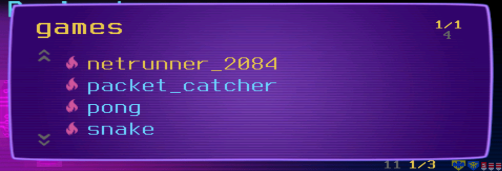
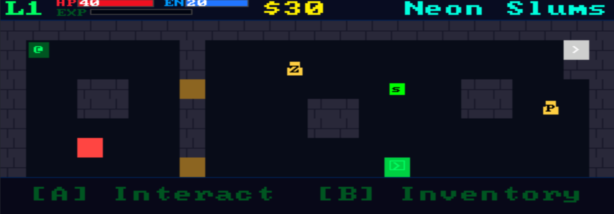
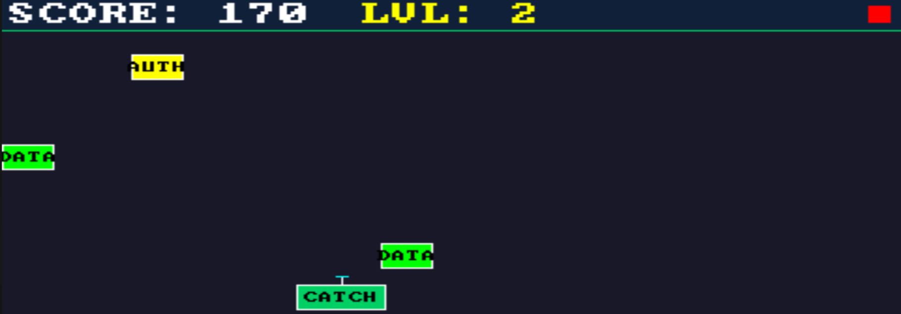
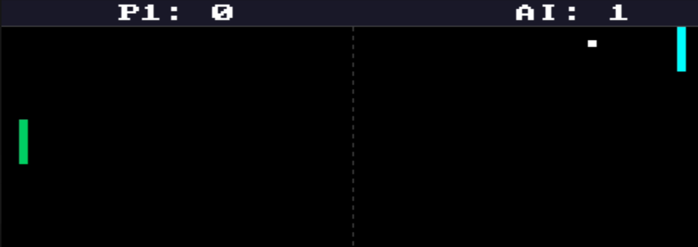
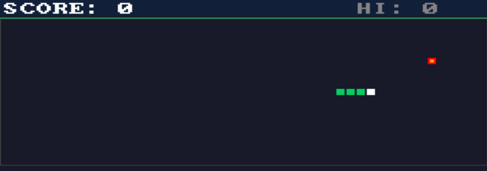
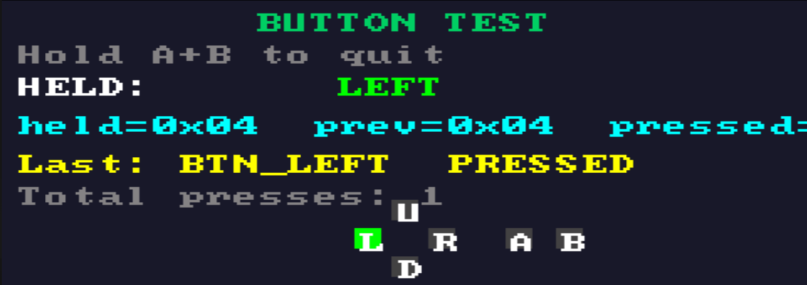

## Hexxed BitHeadz WiFi Pineapple Pager repo

Well it happened again, a neat new little gadget released and has stolen our attention from our everyday lives XD

The Hak5 WiFi Pineapple Pager released, and we cant stop poking at it. We've start learning about the device as quick as possible, begin working on some test tools and simple games to test it's capabilities.

So we have a few basic games built as early proof of concepts, we've learned how to accessible from the payloads screen so they can be launched and played directly on the pager.

This repo is totally experimental, and are used as early testing for us to learn more about the WiFi Pineapple Pager

The source code is all here, to compile games, below are steps we took to compile and send to the pager while connected via USB

### Install dependencies
```
sudo apt update && sudo apt install git make build-essential -y
sudo wget -P /opt https://musl.cc/mipsel-linux-muslsf-cross.tgz
sudo tar xzf /opt/mipsel-linux-muslsf-cross.tgz -C /opt
export PATH="/opt/mipsel-linux-muslsf-cross/bin:$PATH"
```

### Install games
```
git clone https://github.com/HexxedBitHeadz/WiFiPineapplePager && cd WiFiPineapplePager/games
export PATH="/opt/mipsel-linux-muslsf-cross/bin:$PATH"
make clean && make CROSS_COMPILE=mipsel-linux-muslsf-
make deploy CROSS_COMPILE=mipsel-linux-muslsf-
```

It'll ask you for your Pager password, once entered, it will transfer the games over.

At this point as long as the device is plugged in and accessible via ssh root@172.16.52.1, the games should be seen in payloads > games from the main screen. 

There is also a test/test_hw.c tool that was used to assist getting the buttons figured out. We are including that tool here as well, in case a button test is needed.

### Install button test
```
git clone https://github.com/HexxedBitHeadz/WiFiPineapplePager && cd WiFiPineapplePager/test
export PATH="/opt/mipsel-linux-muslsf-cross/bin:$PATH"
make clean && make CROSS_COMPILE=mipsel-linux-muslsf-
make deploy CROSS_COMPILE=mipsel-linux-muslsf-
```

Similar to before, just navigate to general > test_hw to see it in action!

Games listed in payload > games menu:


Image of netrunner 2084 game:


Image of packet capture game:


Image of pong game:


Image of snake game:


Image of button test tool:



